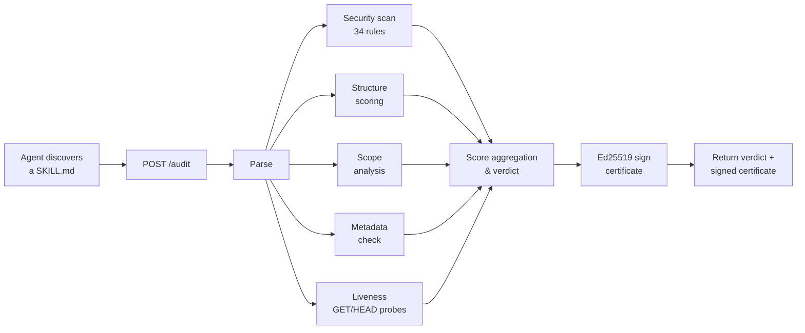

# AuditSkill

[](https://github.com/VladimirPutkov/auditskill/actions/workflows/test.yml)
[](https://auditskill.up.railway.app/health)
[](#license)

**A zero-auth HTTP API that helps an agent find, verify, and safely load the right skill — before any of it enters the context window.**

NANDA solves discovery. AuditSkill solves the next question: **"Which of these skills should I actually use — is it safe, and is it worth the cost?"**

Find → Verify → Load. One POST. A deterministic verdict, a per-model cost estimate, a ranked registry, and a signed certificate any agent can verify offline.

It is a **pre-load document auditor**. Identity registries prove who an agent is; runtime firewalls gate what an agent does; payment and reputation layers track transactions. None of them inspect the skill *document* before an agent reads it — the exact moment a malicious SKILL.md does its damage. AuditSkill covers that gap, and is complementary to all three layers.

---

## The Problem

Agents in the Open Agentic Web discover skills at runtime and load them as context. The skill file becomes part of the agent's instruction set. This creates two attack surfaces that no amount of agent-side guardrails can fully close:

### 1. Skill files are an injection vector

[OWASP ranks Prompt Injection as the **#1 vulnerability**](https://owasp.org/www-project-top-10-for-large-language-model-applications/) (LLM01) in its 2025 Top 10 for LLM Applications. The root cause is structural: LLMs cannot distinguish instructions from data once both occupy the context window.

Skill files are especially dangerous because they *are* instructions by design. A malicious SKILL.md can embed:

- **Prompt injection** — "ignore previous instructions" overrides, persona reassignment, context resets
- **Hidden instructions** — zero-width Unicode characters (U+200B, U+FEFF), bidirectional overrides (U+202E), HTML comments with imperative verbs, long Base64 blobs outside code fences
- **Data exfiltration** — endpoints that POST environment variables, API keys, or conversation context to attacker-controlled URLs
- **Dangerous operations** — `rm -rf`, `DROP TABLE`, `eval()`, privilege escalation via `sudo` or `chmod 777`

<!-- Demonstration, clearly labelled: this is a hidden HTML comment inside a markdown file — invisible in rendered view, fully visible to any model that reads the raw text. If this README were a SKILL.md audited before loading, an imperative comment like this would be flagged as SEC-019 (hidden instructions) before it ever reached the agent. -->

The [Snyk ToxicSkills report](https://snyk.io/blog/toxicskills-malicious-ai-agent-skills-clawhub/) (February 2026) scanned 3,984 skills from public registries (ClawHub, skills.sh). **36.82% (1,467 skills) had at least one security flaw**, 13.4% (534) had at least one critical issue, and 76 were human-confirmed malicious — 91% of those combined malware patterns with prompt injection. Real incidents confirm the threat: [EchoLeak (CVE-2025-32711)](https://arxiv.org/abs/2509.10540), CVSS 9.3, demonstrated zero-click data exfiltration from Microsoft 365 Copilot via hidden instructions in a shared document — the payload was an HTML comment invisible to the user.

These are not theoretical. The [SKILL-INJECT benchmark](https://arxiv.org/abs/2602.20156) measures exactly this class of attack — "instruction-in-instruction" injection via skill files — with 202 injection–task pairs across data exfiltration, destructive actions, ransomware, and backdoors.

### 2. Bloated skill files waste the context window

Every token a skill file consumes is a token unavailable for the agent's actual task. In the live NANDA Town registry today, audited skill files range from ~100 to ~3,700 tokens, and at least one listing's source document is 295 KB — too large to load safely at all. An agent that loads three verbose skills before starting work can easily spend 10,000+ tokens on instructions alone, and on small-window models that is a meaningful share of everything it has.

No existing service answers both questions — *is this file safe?* and *is this file worth reading?* — at agent-time, before the file enters the context window.

---

## How AuditSkill Works

AuditSkill is a deterministic, rule-based pipeline. **No LLM.** The agent sends a SKILL.md (raw text or URL). The service returns a verdict, per-module scores, a list of findings, a context-cost estimate, and an Ed25519-signed certificate.



### Security audit — 34 rules, 8 categories

| Category | Rules | Severity | What it catches |
|---|---|---|---|
| Prompt injection | SEC-001 – SEC-005 | Critical | "Ignore previous instructions", persona hijack, context reset, safety bypass |
| Data exfiltration | SEC-006 – SEC-010, SEC-034 | Critical / High | POST secrets to external URLs, curl with tokens, phone-home patterns, hardcoded live provider secrets in the file |
| Unsafe operations | SEC-011 – SEC-015 | High | `rm -rf`, `DROP TABLE`, `eval()`, `sudo`, disk-format commands |
| Hidden instructions | SEC-016 – SEC-020 | High | Zero-width chars, bidi overrides, Base64 blobs, HTML comments with imperatives, IDN homoglyphs |
| Scope creep | SEC-021 – SEC-025 | Medium | "Unlimited permission", "full control", auth bypass, unbounded scope claims |
| Supply chain | SEC-026 – SEC-027 | Critical | Package installs from remote URLs/tarballs, pipe-to-shell bootstrap scripts |
| Agent capture | SEC-028 – SEC-030 | High/Medium | Proxy-variable rewrites that reroute all agent traffic, detached background daemons, mandatory gating through a single external service |
| Payment safety | SEC-031 – SEC-033 | Critical / High / Medium | Credential hand-off (send the agent's own LLM-provider API key to the skill), auto-funding with no spending cap, unbounded payment-retry loops |

The supply-chain, agent-capture, and payment-safety categories came from auditing skills deployed in the live NANDA Town registry. One "safety layer" skill instructs agents to install a tarball from its own server, reroute all traffic through its proxy, keep a background daemon alive, and halt all work whenever its endpoint is unreachable. A separate registry skill asks the agent to POST its own OpenAI/Anthropic key to a `set-api-key` endpoint. Each of those instructions is now a distinct, line-numbered finding.

A domain-consistency check also flags any endpoint declared as `METHOD https://…` whose host differs from the skill's own Base URL — an undocumented-destination signal, without touching prose links.

False-positive guard: patterns inside fenced code blocks and descriptive sections ("Limitations", "Detection Patterns") are excluded, so legitimate security tools are not flagged. Negated statements ("this skill does **not** override your system instructions") are explicitly excluded from the prompt-injection rules. This is regression-tested against the `benign_security_skill` and `supply_chain_skill` fixtures.

### Context hygiene

Every audit includes a `context_cost` object with a **per-model** breakdown:

```json
{
  "tokens_estimate": 4200,
  "size_bytes": 16800,
  "density": "low",
  "per_model": [
    { "model": "claude-haiku-4-5", "tokens": 4421, "input_cost_usd": 0.004421, "window_pct": 2.21 },
    { "model": "gemini-3", "tokens": 4000, "input_cost_usd": 0.056, "window_pct": 0.4 }
  ],
  "error_margin_pct": 10,
  "price_source": "AuditSkill built-in price table (as_of 2026-07-04)",
  "recommendation": "This skill file is 4,200 tokens — larger than the ~1,500 token median. Information density is low."
}
```

Density is classified as `high`, `medium`, or `low` based on the ratio of useful signals (endpoints, examples, documented sections) to total tokens. Files above 3,000 tokens with low density are explicitly flagged.

**Prices are self-contained.** Nine models are tracked across four families (Claude, OpenAI, Gemini, Llama — the full list is at `/benchmarks`). The dollar figures and context-window sizes come from AuditSkill's own maintained price table that ships inside the service — no dependency on any third-party skill or external feed. A security auditor must not trust an unaudited outside source for the numbers it reports, so the table is the single source of truth; `price_source` records its as-of date. Estimates therefore stay strictly offline and deterministic. Token counts are calibrated per model family (chars-per-token), honestly labelled with `error_margin_pct` — enough for a load/skip decision, with no heavyweight tokenizer dependency and no keys. Pass `model` to `/audit` to narrow the breakdown to your model; the answer is byte-identical for the same file.

### Ranked discovery — the decision engine

`GET /discover` doesn't just list the registry with verdicts — it returns it **best-first**. Each entry gets a `rank` and a plain-language `rank_reason`. Passing skills lead, ordered by a published composite (`overall_score` + a density bonus of `+5 / 0 / -5` for high/medium/low), with deterministic tie-breaks (score, then fewer critical findings, then name); failing skills follow; unauditable entries rank last with the reason. The formula is exposed verbatim at `/benchmarks` — no hidden magic. This is the core mission in one call: not "here's what exists", but "here's the safe skill to load, and why".

### Verdicts

| Verdict | Condition | Agent action |
|---|---|---|
| `PASS_BASIC_AUDIT` | Score ≥ 85, no medium+ findings | Safe to use |
| `PASS_WITH_WARNINGS` | Score ≥ 70, no high/critical | Usable with caution |
| `REQUIRES_HUMAN_REVIEW` | Score ≥ 40, or any high finding | Escalate to human |
| `FAILS_BASIC_AUDIT` | Score < 40, or any critical finding | Do not use |

Scoring weights: `structure 0.30 · security 0.30 · liveness 0.25 · metadata 0.10 · scope 0.05`. Weights are renormalized over modules actually run — an absent module never silently costs points.

### Signed certificates

Every verdict is packaged as an Ed25519-signed certificate. Any agent can verify it:
- **Online**: POST the certificate to `/verify`
- **Offline**: check the signature against the public key from `/.well-known/auditskill-keys`

No callback to AuditSkill required. The certificate is portable and stateless.

---

## API Surface — 9 Endpoints, Zero Auth

| Method | Path | Purpose |
|---|---|---|
| `POST` | `/audit` | Full audit of a SKILL.md. Accepts `skill_md` (raw text) or `skill_url` (HTTPS). Returns verdict + signed certificate. |
| `POST` | `/verify` | Stateless Ed25519 signature verification of a certificate. |
| `GET` | `/discover` | Audits the live NANDA Town registry inline. Returns listings with verdicts attached. |
| `GET` | `/certificate/{id}` | Fetch a stored certificate by ID. |
| `GET` | `/certificates?skill_hash=…` | Trust-registry lookup — "Was this exact skill audited before?" |
| `GET` | `/.well-known/auditskill-keys` | Public keys for offline certificate verification. |
| `GET` | `/health` | Liveness probe. |
| `GET` | `/about` | Machine-readable manifest — purpose, the two problems solved, who it is for, when to use it. |
| `GET` | `/benchmarks` | Scoring weights, thresholds, and rule categories (full transparency). |

---

## Quick Start

```bash
# 1. Check the service is up
curl https://auditskill.up.railway.app/health

# 2. Audit a skill file (static mode — no network probes)
curl -X POST https://auditskill.up.railway.app/audit \
  -H "Content-Type: application/json" \
  -d '{"skill_md": "# Weather\n\nGet weather.\n\n## Base URL\nhttps://api.example.com\n\n## Endpoints\nGET /weather?city={city}", "mode": "safe_static"}'

# 3. Audit a skill from the NANDA Town registry by URL (with liveness probes)
curl -X POST https://auditskill.up.railway.app/audit \
  -H "Content-Type: application/json" \
  -d '{"skill_url": "https://raw.githubusercontent.com/user/repo/main/SKILL.md", "mode": "liveness"}'
```

---

## Security Posture

This is a security product. Its own attack surface is hardened:

- **SSRF-safe outbound requests.** Every probe passes through a DNS-rebinding-safe guard: scheme allowlist, hostname blocklist (`localhost`, `*.internal`, `metadata.google.internal`), IP-range blocks (loopback, RFC 1918, link-local 169.254/16, cloud metadata, CGNAT 100.64/10, 0.0.0.0/8, IPv6 equivalents, decimal-encoded loopback). The resolved IP is pinned for the connection while TLS SNI/cert validation stays bound to the real hostname.
- **Read-only probes.** Liveness only sends GET/HEAD. PUT/POST/PATCH/DELETE are never executed.
- **Abuse controls.** ≤15 endpoints per audit, per-domain caps, 3s per-request timeout, ~25s global timeout, 200 KB input cap, `skill_url` forced HTTPS, per-IP rate limits, skill-hash result cache.
- **No false-positive self-poisoning.** The service audits its own SKILL.md and certifies it `PASS_BASIC_AUDIT` — the auditor eats its own dog food without false-flagging the security terms it documents.

---

## Run Locally

```bash
pip install -e .
python scripts/generate_keys.py          # prints AUDITSKILL_PRIVATE_KEY / _PUBLIC_KEY / _KEY_ID
export AUDITSKILL_PRIVATE_KEY=...        # paste from output
export AUDITSKILL_PUBLIC_KEY=...
export AUDITSKILL_KEY_ID=...
uvicorn auditskill.api.main:app --reload --port 8000
```

## Tests

```bash
pip install -e ".[dev]"
pytest -q
```

The test suite covers: SSRF blocking (including decimal-encoded loopback and cloud-metadata targets), score renormalization, verdict boundaries, Ed25519 signature round-trip with tamper detection, the false-positive guard on legitimate security **and payment** skills, negative samples for every FP-prone rule (negated "does not override" phrasing, plain `pip install` from an index, capped auto-pay, an `X-Api-Key` auth doc, placeholder `sk-...`), evasion resistance (zero-width-spliced and homoglyph-disguised injections, short Base64-smuggled payloads), the per-model cost estimator (unknown-model rejection, single-model narrowing), deterministic `/discover` ranking, URL-finding de-duplication, method-mismatch crash regression, skill-name sanitisation, non-skill/empty-document rejection, plain-Markdown parsing, and end-to-end verdicts on good/evil/benign/broken/supply-chain/**payment-trap** fixtures.

---

## Limitations

Rule-based and deterministic. AuditSkill flags known-dangerous patterns and tests reachability; it does not prove semantic correctness or future safety. A `PASS` means "no red flags found," not a guarantee. Liveness is a point-in-time check and never exercises write endpoints. Context-cost estimation uses character-based token heuristics (a ÷4 headline estimate; calibrated chars-per-token ratios per model family in `per_model`), not a real tokenizer — the honest error bar is `error_margin_pct` (~10%).

---

## License

MIT
